# Android Architecture for Automotive

## 1. Android vs Android Auto vs Android Automotive OS

Android is a full software stack based on Linux.

```text
Android = Linux Kernel + HAL + Native Libraries + Runtime + Framework + Apps
```

---

## Android Auto

Android Auto is **not** a full operating system inside the car.

It is mainly phone projection.

```text
Phone Android OS
        |
        v
Car Screen
```

The phone runs the apps, and the car screen only displays and controls them.

---

## Android Automotive OS — AAOS

Android Automotive OS is a full Android system installed directly on the car infotainment hardware.

```text
Car Hardware
     |
     v
Android Automotive OS
     |
     v
Car Apps / Infotainment System
```

Full stack view:

```text
Car Hardware
     |
     v
Linux Kernel
     |
     v
HAL
     |
     v
Native Libraries + Android Runtime
     |
     v
Application Framework
     |
     v
Applications
```

---

# 2. Android Architecture Overview

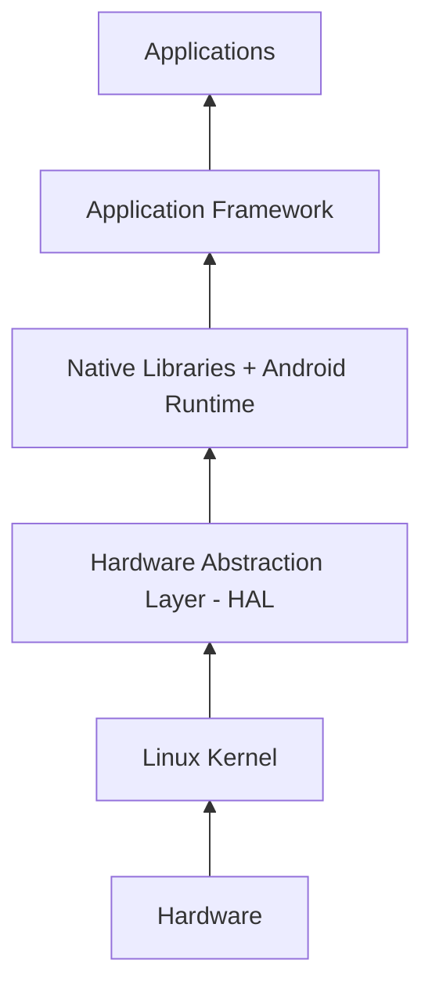

Simple architecture view:

```text
+----------------------------------+
|          Applications            |
+----------------------------------+
|      Application Framework       |
+----------------------------------+
| Android Runtime + Native Libs    |
+----------------------------------+
|              HAL                 |
+----------------------------------+
|          Linux Kernel            |
+----------------------------------+
|            Hardware              |
+----------------------------------+
```

---

# 3. Linux Kernel Layer

The Linux Kernel is the lowest software layer in Android.

It talks directly to the hardware through drivers.

```text
Android System
      |
      v
Linux Kernel
      |
      v
Hardware
```

## Kernel Responsibilities

```text
Process Management
Memory Management
Device Drivers
Power Management
Security Basics
```

## Examples of Kernel Drivers in Automotive

```text
Display Driver
Touch Driver
Audio Driver
Bluetooth Driver
Wi-Fi Driver
USB Driver
CAN Driver
Storage Driver
Power Management Driver
```

## Example: Touch Event

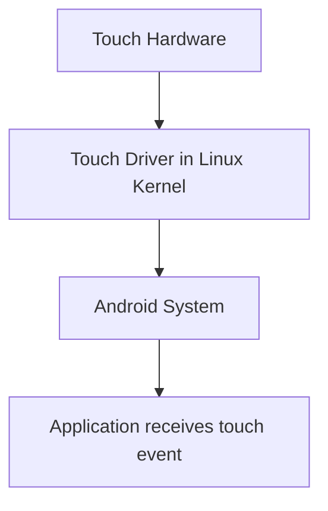

## Example: Audio Playback

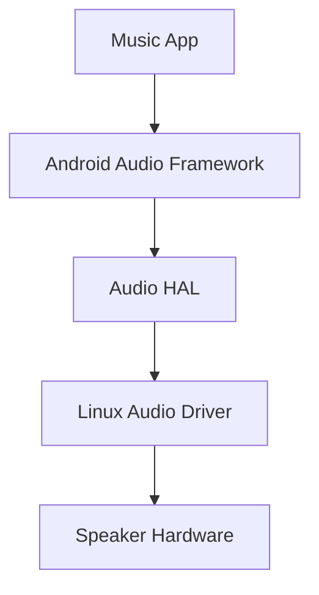

## Key Point

```text
Linux Kernel is the bridge between Android software stack and physical hardware.
```

---

# 4. HAL — Hardware Abstraction Layer

HAL means:

```text
Hardware Abstraction Layer
```

The HAL hides hardware details from Android.

Android should not care if the audio chip, camera chip, or CAN controller is different from one car to another.

Instead, Android talks to a standard HAL interface.

```text
Android Framework
       |
       v
HAL Interface
       |
       v
HAL Implementation
       |
       v
Linux Kernel Driver
       |
       v
Hardware
```

---

## HAL vs Kernel Driver

```text
Hardware
   |
   v
Kernel Driver
   |
   v
HAL
   |
   v
Android Framework
```

### Kernel Driver

The kernel driver is low-level.

It deals with:

```text
Registers
Interrupts
DMA
Buffers
Device files
```

### HAL

The HAL gives Android a clean and standard API.

Examples:

```text
getVehicleSpeed()
setHvacTemperature()
getDoorState()
setVolume()
```

---

## Important Correction

The HAL alone does not make Android work on any hardware automatically.

The correct idea is:

```text
Android Framework stays mostly the same.
HAL implementation and Kernel driver change depending on the hardware.
```

Diagram:

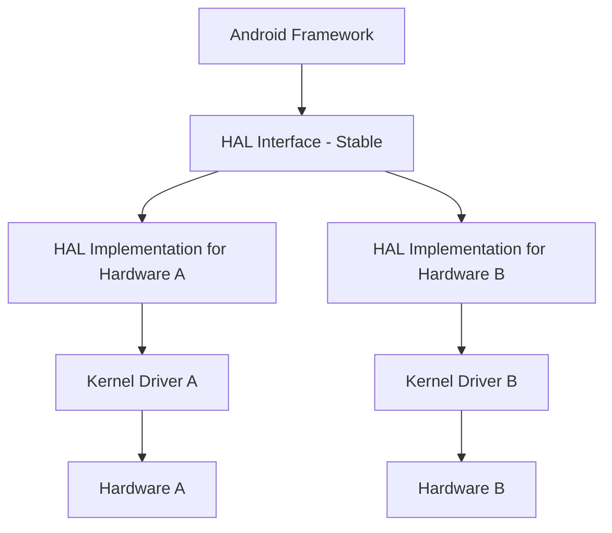

---

## Vehicle HAL — VHAL

In Android Automotive, there is an important HAL called:

```text
Vehicle HAL
```

or:

```text
VHAL
```

It is responsible for vehicle properties such as:

```text
Vehicle speed
Gear position
Fuel level
HVAC temperature
Door state
Seat belt state
Parking brake state
```

Example flow:

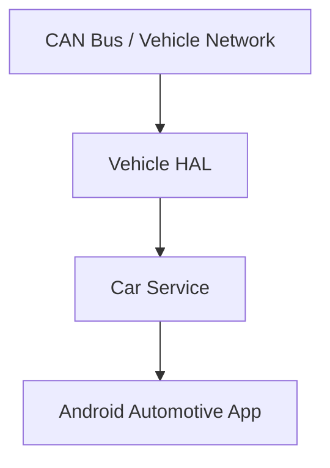

Example: Display vehicle speed

```text
CAN Bus receives vehicle speed
        |
        v
Vehicle HAL reads speed
        |
        v
Car Service exposes speed
        |
        v
App displays speed
```

## Key Point

```text
HAL gives Android a standard way to talk to different hardware.
```

---

# 5. Native Libraries + Android Runtime

This layer contains two main parts:

```text
1. Native Libraries
2. Android Runtime - ART
```

Architecture position:

```text
Applications
    ↑
Application Framework
    ↑
Native Libraries + Android Runtime
    ↑
HAL
    ↑
Linux Kernel
    ↑
Hardware
```

---

# 5.1 Native Libraries

Native Libraries are libraries written mainly in C/C++.

Android uses them for high-performance and system-level features.

Examples:

```text
Bionic
OpenGL ES
Vulkan
SQLite
Media Libraries
SSL / Crypto Libraries
```

---

## Bionic

Bionic is Android's C standard library.

In normal Linux systems, we usually have:

```text
glibc
```

But Android uses:

```text
Bionic
```

Native C/C++ code uses Bionic for functions like:

```c
printf();
malloc();
free();
open();
read();
write();
pthread_create();
```

Flow:

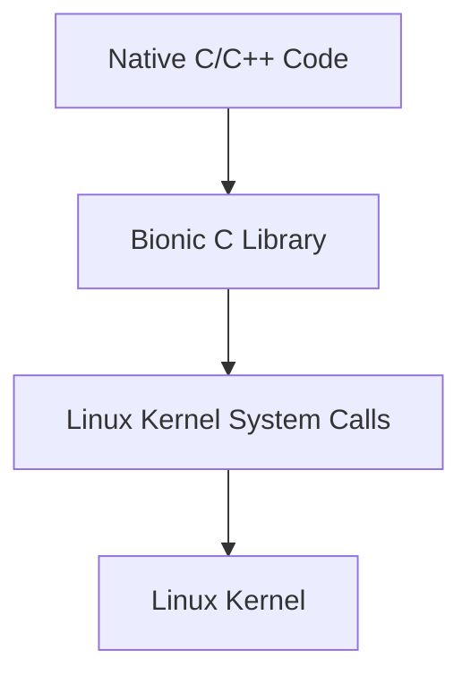

Key point:

```text
Bionic is Android's C standard library.
```

---

## OpenGL ES

OpenGL ES is a graphics API.

ES means:

```text
Embedded Systems
```

It is used for 2D/3D rendering.

Examples:

```text
Animations
Maps
Car dashboard graphics
3D objects
UI effects
Games
```

Flow:

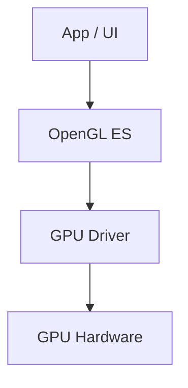

---

## Vulkan

Vulkan is also a graphics API, but it is lower-level than OpenGL ES.

Comparison:

```text
OpenGL ES:
Easier, higher-level graphics API

Vulkan:
Harder, lower-level, more control, better performance
```

Vulkan gives more control over the GPU and can improve performance.

Flow:

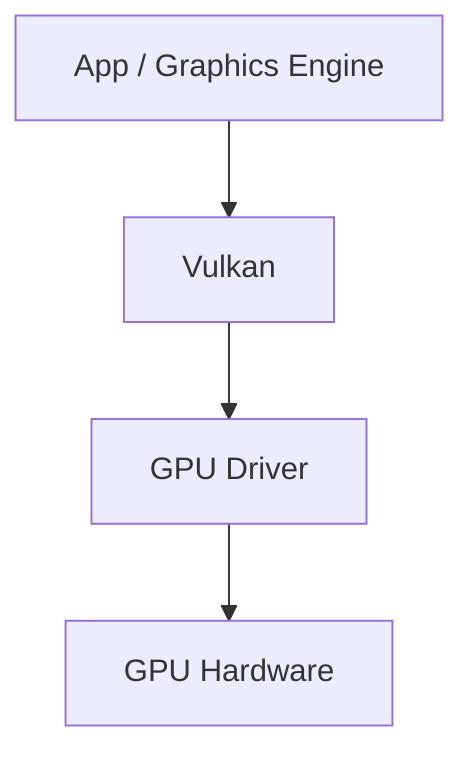

---

## SQLite

SQLite is a small embedded database inside Android.

It is used to store local app data.

Examples:

```text
User settings
Media playlists
Contacts cache
Navigation history
App configuration
```

Automotive examples:

```text
Music app saves playlists
Settings app saves preferences
Navigation app saves recent destinations
```

Flow:

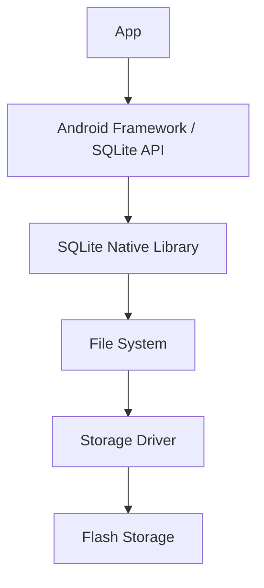

---

## Media Libraries

Media libraries are used for audio and video processing.

They handle things like:

```text
Decode MP3
Decode AAC
Decode H.264 video
Play video
Record audio
Stream media
```

Example: Play music

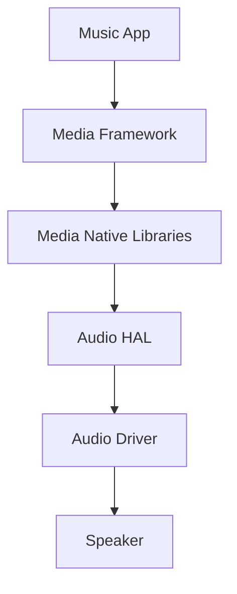

---

## SSL / Crypto Libraries

These libraries are used for security and encryption.

Used in:

```text
HTTPS
Certificates
Encryption
Secure communication
OTA update security
```

Automotive OTA example:

```text
Download update using HTTPS
Verify certificate
Check hash
Verify signature
Install update
```

---

# 5.2 Android Runtime — ART

ART means:

```text
Android Runtime
```

ART runs Android apps written in Java/Kotlin.

Flow:

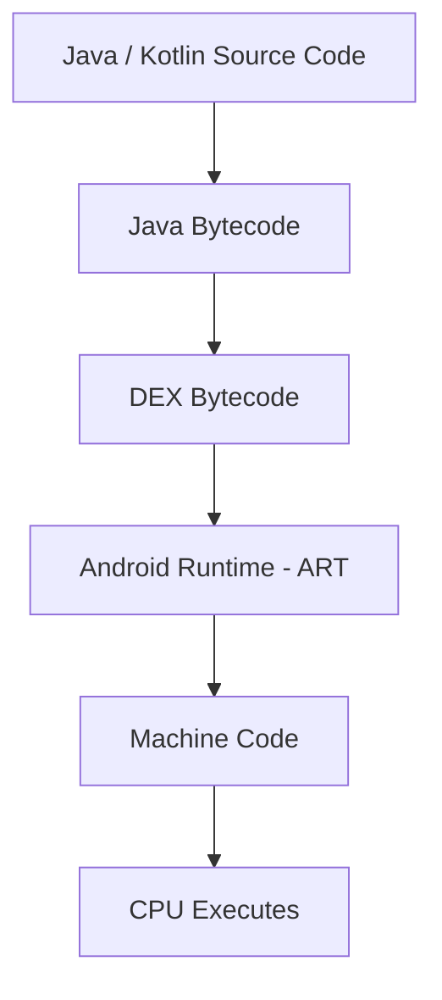

---

## What is DEX?

DEX means:

```text
Dalvik Executable
```

Android does not run normal Java `.class` files directly.

Android converts app code into:

```text
classes.dex
```

APK usually contains:

```text
classes.dex
resources
AndroidManifest.xml
native libraries if needed
```

---

## ART Responsibilities

ART is responsible for:

```text
Running Java/Kotlin apps
Memory management for app objects
Garbage Collection
Code optimization
Exception handling
Thread management support
```

---

## Garbage Collection

In C/C++, you manually allocate and free memory.

Example:

```c
malloc();
free();
```

But in Kotlin/Java:

```kotlin
val car = Car()
```

You do not manually free the object.

ART has a Garbage Collector that removes unused objects.

Flow:

```text
App creates object
Object is used
Object is no longer referenced
ART Garbage Collector removes it from memory
```

---

## JIT and AOT

ART uses optimization techniques.

```text
JIT = Just In Time
AOT = Ahead Of Time
```

### AOT

AOT means the code is compiled before running.

```text
DEX
 |
 v
Compiled earlier
 |
 v
Machine code ready
```

### JIT

JIT means the runtime compiles hot code while the app is running.

```text
App running
 |
 v
ART detects hot code
 |
 v
Compile / optimize it
 |
 v
Run faster next time
```

Simple comparison:

```text
AOT: compile before running
JIT: compile while running
```

---

## ART vs Native Libraries

```text
ART:
Runs the Java/Kotlin app logic.

Native Libraries:
Do heavy system work like media, graphics, database, crypto.
```

Example: Play video

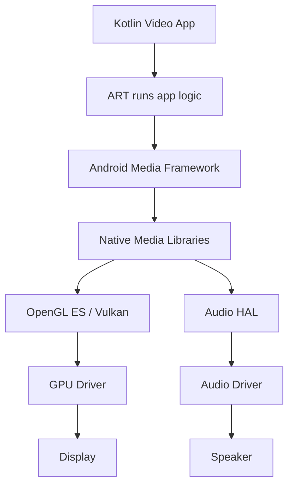

Key point:

```text
ART runs the app logic, while Native Libraries do heavy system work.
```

---

# 6. Application Framework

The Application Framework provides high-level APIs and services used by Android apps.

Apps do not talk directly to HAL or Kernel.

Apps talk to the Application Framework.

```text
App
 |
 v
Application Framework
 |
 v
System Services / Native Libraries / HAL
 |
 v
Kernel
 |
 v
Hardware
```

---

## Important Framework Services

```text
Activity Manager
Window Manager
Package Manager
Resource Manager
Content Providers
View System
Car APIs in Android Automotive
```

---

## Activity Manager

Responsible for managing activities and app screens.

Examples of activities:

```text
Settings Screen
Music Screen
Bluetooth Screen
Navigation Screen
```

Activity lifecycle:

```text
onCreate()
   ↓
onStart()
   ↓
onResume()
   ↓
Activity Running
   ↓
onPause()
   ↓
onStop()
   ↓
onDestroy()
```

---

## Window Manager

Responsible for managing windows on the screen.

It controls:

```text
Which window is on top
Fullscreen windows
Popups
Window size
Screen orientation
```

Automotive examples:

```text
Navigation area
Media area
Climate popup
Reverse camera view
System alerts
```

Example:

```text
Reverse camera opens
      |
      v
Window Manager puts camera view on top
```

---

## Package Manager

Responsible for installed apps.

It knows:

```text
Installed apps
App permissions
App version
App components
App signatures
```

When installing an APK, Package Manager reads:

```text
AndroidManifest.xml
```

---

## Resource Manager

Responsible for app resources.

Examples:

```text
Images
Strings
Colors
Layouts
Fonts
Translations
```

Example:

```text
strings.xml English
strings.xml Arabic
```

Resource Manager selects the correct resources depending on language, screen size, etc.

---

## Content Providers

Content Providers share data between apps or services in a controlled way.

Examples:

```text
Contacts Provider
Media Provider
Settings Provider
```

Automotive examples:

```text
Media library
User profile
System settings
Navigation saved places
```

---

## View System

Responsible for UI widgets.

Examples:

```text
Button
TextView
ImageView
RecyclerView
Switch
Slider
```

Flow:

```text
Button on screen
      |
      v
User clicks
      |
      v
Framework sends click event to app
```

---

## Car API / Car Framework

In Android Automotive, there is an automotive-specific framework.

It allows apps to access vehicle-related features safely.

Examples:

```text
Vehicle speed
Gear
HVAC temperature
Door state
Seat state
```

Flow:

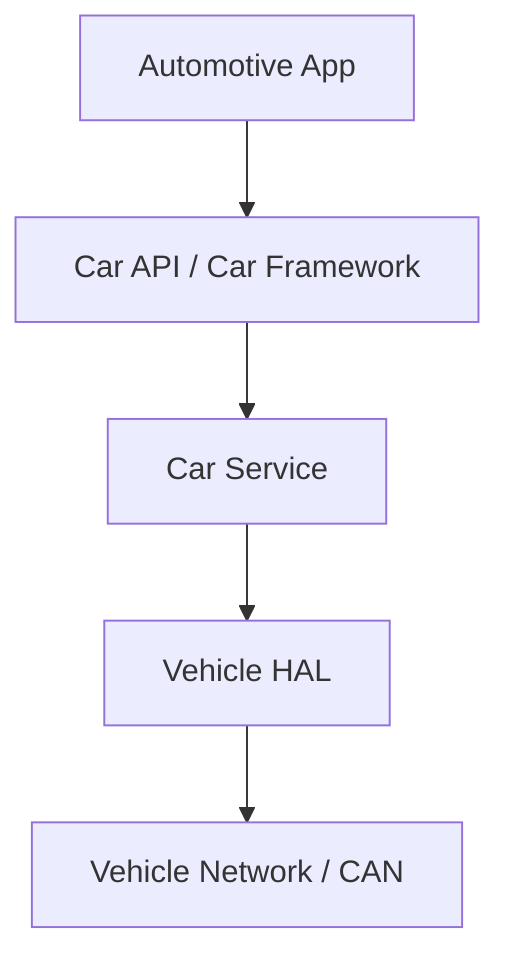

Example: Gear Position

```text
Gear App
   |
   v
Car API
   |
   v
Car Service
   |
   v
Vehicle HAL
   |
   v
CAN Driver
   |
   v
Vehicle ECU
```

Key point:

```text
Apps do not talk directly to hardware.
Apps talk to the Application Framework.
```

---

# 7. Binder IPC

Binder is Android's main IPC mechanism.

IPC means:

```text
Inter-Process Communication
```

It means communication between processes.

---

## Why IPC is needed

Each Android app usually runs in a separate process.

Example:

```text
Music App        → Process A
Settings App     → Process B
System Server    → Process C
Car Service      → Process D
```

Processes are isolated for:

```text
Security
Stability
Memory protection
```

So apps need a safe way to talk to system services.

That way is:

```text
Binder IPC
```

---

## Binder Basic Flow


Simple view:

```text
App Process
   |
   | Binder transaction
   v
/dev/binder
   |
   v
System Service Process
```

---

## Binder Example: Location

```text
App
 |
 v
LocationManager API
 |
 v
Binder IPC
 |
 v
LocationManagerService
 |
 v
GPS / Network / HAL / Driver
```

The app calls a normal API, but internally the request goes through Binder.

---

## Binder Proxy and Stub

Binder uses two important parts:

```text
Proxy
Stub
```

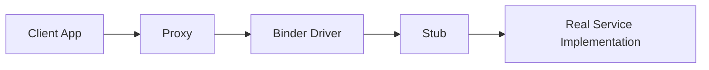

### Proxy

Proxy exists on the client side.

It looks like the real service to the app.

### Stub

Stub exists on the server side.

It receives the Binder transaction and calls the real service function.

---

## AIDL

AIDL means:

```text
Android Interface Definition Language
```

It defines interfaces between processes.

Example:

```aidl
interface ICarInfo {
    float getVehicleSpeed();
}
```

Android build system generates:

```text
Proxy
Stub
Transaction codes
Parceling / Unparceling code
```

---

## Parcel

You cannot send memory addresses between different processes.

So Android converts data into a transferable format called:

```text
Parcel
```

Flow:


Example:

```text
speed = 80.5
      |
      v
Write float into Parcel
      |
      v
Send using Binder
      |
      v
Read float from Parcel
```

---

## Binder in Android Automotive

Example: Read vehicle speed

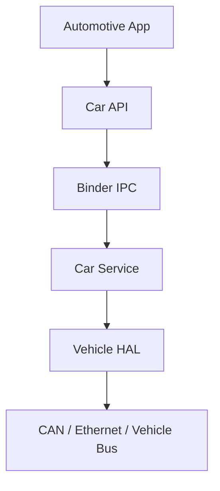

Example: Change HVAC temperature

```text
Climate App
     |
     v
Car API
     |
     v
Binder IPC
     |
     v
Car Service
     |
     v
Vehicle HAL
     |
     v
HVAC ECU
```

---

## Binder vs HAL

Binder is not a replacement for HAL.

```text
Binder = communication between processes
HAL = communication between Android system and hardware abstraction layer
```

Full flow:

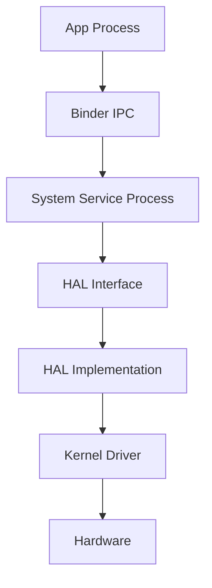

---

## Binder vs Normal IPC

Normal IPC examples:

```text
Sockets
Pipes
Shared Memory
Message Queues
Signals
```

Binder is different because it is Android's secure RPC-style IPC mechanism.

---

## Difference 1: Binder is Object-Oriented IPC

Normal IPC usually sends bytes.

```text
Client sends: GET_SPEED
Server parses message
Server replies: 80
```

Binder uses interfaces and method calls.

Example:

```aidl
interface ICarInfo {
    float getSpeed();
}
```

App code:

```kotlin
carInfo.getSpeed()
```

Internally:

```text
Function call
   ↓
Parcel
   ↓
Binder transaction
   ↓
Remote service
   ↓
Return value
```

---

## Difference 2: Binder Knows Caller Identity

Binder carries caller identity.

```text
UID
PID
Permission context
```

Example:

```text
App requests vehicle speed
        |
        v
Binder sends caller UID
        |
        v
Car Service checks permission
        |
        v
Allow / Deny
```

---

## Difference 3: Binder is Integrated with Android Framework

Many Android system services use Binder:

```text
ActivityManager
PackageManager
WindowManager
AudioService
LocationService
CarService
```

Flow:

```text
App
 |
 v
Framework API
 |
 v
Binder
 |
 v
System Service
```

---

## Difference 4: Binder Generates Proxy and Stub

With AIDL, Android can generate:

```text
Proxy
Stub
Parceling code
Transaction codes
```

With sockets or pipes, you must usually write:

```text
Protocol
Serialization
Sending
Receiving
Parsing
Error handling
Response handling
```

---

## Difference 5: Binder Uses Kernel Driver

Binder is not only a user-space library.

It uses a Linux kernel driver.

```text
Client Process
     |
     v
Binder Kernel Driver
     |
     v
Server Process
```

The Binder driver handles:

```text
Deliver transactions
Manage references to Binder objects
Pass caller identity
Handle synchronization/waiting
```

---

## Difference 6: Binder Supports Remote Object References

Binder can pass references to remote objects.

Example:

```text
App gets reference to AudioService
App calls methods on this reference
Binder routes calls to real AudioService
```

---

## Difference 7: Binder is Good for Request/Response

Binder is excellent for:

```text
getVolume()
setVolume()
getVehicleSpeed()
requestLocation()
startActivity()
```

But for very large data like video frames, Android may use shared memory or buffers.

Example:

```text
Binder:
Start camera stream

Shared buffer:
Actual video frames
```

---

## Binder Summary

```text
Binder IPC:
Android mechanism for communication between processes.
```

Used for:

```text
App to System Service
System Service to System Service
Framework to Native Service
Car App to Car Service
```

Important components:

```text
Client
Proxy
Binder Driver
Stub
Server Service
Parcel
```

Key point:

```text
Binder makes remote service calls look like normal function calls.
```

---

# 8. Applications Layer

Applications are the top layer of Android.

Examples in normal Android:

```text
Phone App
Messages
Camera
Settings
Music
Maps
Gallery
```

Examples in Android Automotive:

```text
Launcher / Home Screen
Settings
Media App
Bluetooth App
Navigation App
Climate App
Rear Camera App
Radio App
Phone Projection App
Vehicle Settings App
```

---

# 9. Android App Components

Android apps are built from components.

Main components:

```text
Activity
Service
Broadcast Receiver
Content Provider
Intent
```

---

## Activity

An Activity is usually a screen or UI page.

Automotive examples:

```text
MusicActivity
ClimateActivity
SettingsActivity
NavigationActivity
```

Example app:

```text
Music App
 ├── MainActivity
 ├── PlayerActivity
 └── SettingsActivity
```

---

## Activity Lifecycle

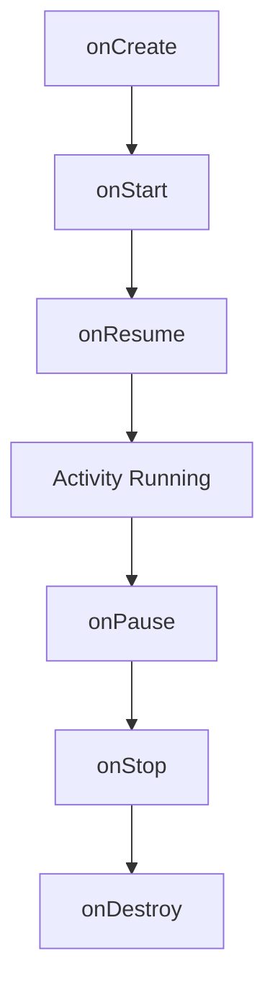

Sometimes the activity returns:

```text
onPause()
   ↓
onResume()
```

Or:

```text
onStop()
   ↓
onRestart()
   ↓
onStart()
   ↓
onResume()
```

---

## Automotive Activity Example

Navigation app is running.

```text
NavigationActivity is running
```

User opens Climate popup.

```text
NavigationActivity → onPause()
ClimateActivity/Popup → onResume()
```

User closes Climate popup.

```text
ClimateActivity → onPause()/onStop()
NavigationActivity → onResume()
```

Rear camera opens.

```text
NavigationActivity → onPause() or onStop()
RearCameraActivity → onResume()
```

This is important because automotive apps must handle screen transitions safely.

---

## Activity and Framework

When writing an Activity:

```kotlin
class MainActivity : Activity() {
}
```

or:

```kotlin
class MainActivity : AppCompatActivity() {
}
```

The Activity is managed by Android Framework.

Flow when opening an app:

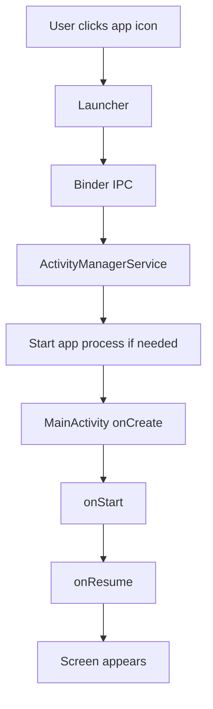

---

# 10. AndroidManifest.xml

Every Android app has an important file:

```text
AndroidManifest.xml
```

It tells Android important information about the app.

Examples:

```text
App package name
Activities
Services
Permissions
Receivers
Minimum SDK
Main launcher activity
```

Simple example:

```xml
<application>
    <activity
        android:name=".MainActivity"
        android:exported="true">

        <intent-filter>
            <action android:name="android.intent.action.MAIN" />
            <category android:name="android.intent.category.LAUNCHER" />
        </intent-filter>

    </activity>
</application>
```

Meaning:

```text
MainActivity is the screen that opens when the user clicks the app icon.
```

---

# 11. Final Full Flow Examples

## Example 1: Music Playback

```mermaid
flowchart TD
    APP[Music App] --> FW[Application Framework - Media APIs]
    FW --> B[Binder IPC]
    B --> AS[Audio Service]
    AS --> ML[Native Media Libraries]
    ML --> AHAL[Audio HAL]
    AHAL --> DRV[Linux Audio Driver]
    DRV --> SPK[Speaker Hardware]
```

---

## Example 2: Vehicle Speed Display

```mermaid
flowchart TD
    APP[Vehicle Speed App] --> CARAPI[Car API]
    CARAPI --> B[Binder IPC]
    B --> CS[Car Service]
    CS --> VHAL[Vehicle HAL]
    VHAL --> CANDRV[CAN Driver]
    CANDRV --> ECU[Vehicle ECU / CAN Bus]
```

---

## Example 3: Touch on Screen

```mermaid
flowchart TD
    TOUCH[Touch Hardware] --> TDRV[Touch Driver]
    TDRV --> K[Linux Kernel]
    K --> FW[Android Input Framework]
    FW --> APP[App Receives Touch Event]
```

---

# 12. Key Summary

```text
Android Auto:
Phone projection to car screen.

Android Automotive OS:
Full Android OS running directly on car hardware.

Linux Kernel:
Lowest layer, talks to hardware using drivers.

HAL:
Standard hardware abstraction interface for Android.

Native Libraries:
C/C++ libraries for performance-heavy features.

Bionic:
Android's C standard library.

OpenGL ES / Vulkan:
Graphics APIs.

SQLite:
Embedded local database.

ART:
Runs Java/Kotlin Android apps using DEX bytecode.

Application Framework:
High-level APIs and system services used by apps.

Binder IPC:
Android's secure RPC-style IPC mechanism.

Applications:
Top layer that users interact with.
```

---

# 13. One-Line Architecture Memory

```text
Apps use Framework APIs,
Framework talks to System Services using Binder,
System Services use Native Libraries and HAL,
HAL talks to Kernel Drivers,
Kernel Drivers control Hardware.
```

```text
Applications
    ↓
Application Framework
    ↓
Binder IPC to System Services
    ↓
Native Libraries / Android Runtime
    ↓
HAL
    ↓
Linux Kernel Drivers
    ↓
Hardware
```
